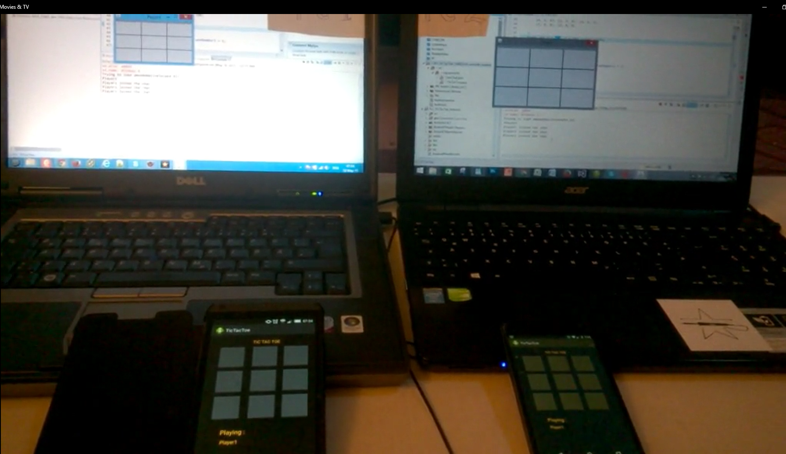

# uMundo_distrubuted_app
This is a distributed application using uMundo framework. uMundo is a distributed Pub/Sub System, an integration of Multicast DNS, ZeroMQ and Protobuf. The designed distributed TicTacToe app for android phone and desktop is a small demonstration of the messaging platform.

* Software used: Eclipse IDE, Android SDK, Java
* Hardware used: Android Nexus Phone, Windows 8 desktops

